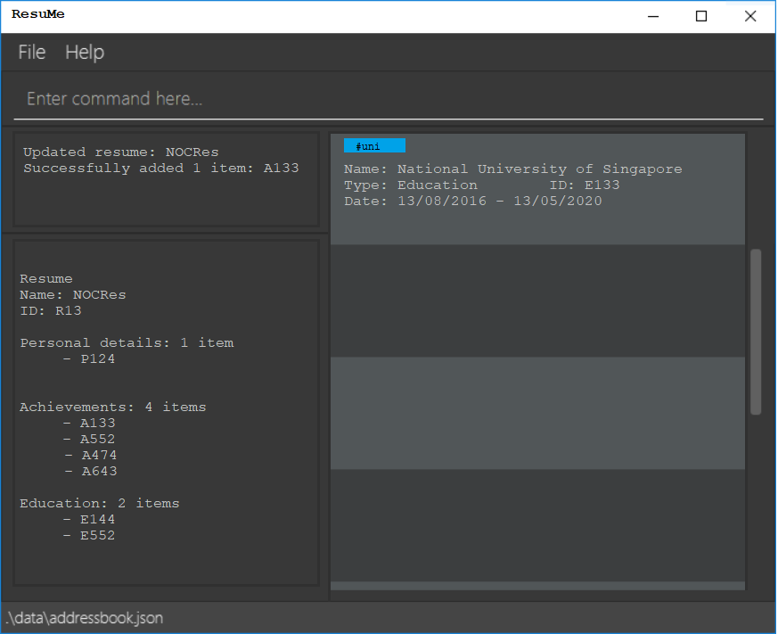

= ResuMe
ifdef::env-github,env-browser[:relfileprefix: docs/]

https://travis-ci.com/AY1920S2-CS2103T-F10-1/main[image:https://travis-ci.com/AY1920S2-CS2103T-F10-1/main.svg?branch=master[Build Status]]
https://coveralls.io/github/AY1920S2-CS2103T-F10-1/main?branch=master[image:https://coveralls.io/repos/github/AY1920S2-CS2103T-F10-1/main/badge.svg?branch=master[Coverage Status]]

ifdef::env-github[]

endif::[]

ifndef::env-github[]
image::images/Ui.png[width="600"]
endif::[]

* This is a desktop Resume management application. It has a GUI but most of the user interactions happen using a CLI (Command Line Interface).
* It is a Java sample application intended for students learning Software Engineering while using Java as the main programming language.
* It is *written in OOP fashion*. It provides a *reasonably well-written* code example that is *significantly bigger* (around 6 KLoC)than what students usually write in beginner-level SE modules.

== Site Map

* <<UserGuide#, User Guide>>
* <<DeveloperGuide#, Developer Guide>>
* <<AboutUs#, About Us>>
* <<ContactUs#, Contact Us>>

== Acknowledgements

* Some parts of this sample application were inspired by the excellent http://code.makery.ch/library/javafx-8-tutorial/[Java FX tutorial] by
_Marco Jakob_.
* Libraries used: https://openjfx.io/[JavaFX], https://github.com/FasterXML/jackson[Jackson], https://github.com/junit-team/junit5[JUnit5]
* The starting point of this code is AddressBook-Level3 project created by https://se-education.org[SE-EDU initiative]

== Licence : link:LICENSE[MIT]

Epstein didn't kill himself
